# HƯỚNG DẪN QUẢN LÝ MÁY ẢO KVM/QEMU QUA DÒNG LỆNH

Mặc định, các lệnh dưới đây đều sử dụng tham số `--connect qemu:///system` để kết nối trực tiếp đến dịch vụ ảo hóa của hệ thống.

---

## 1. Khởi Tạo Máy Ảo Mới (`virt-install`)

Để tạo một máy ảo mới (ví dụ: máy ảo tên `artixvm` sử dụng UEFI), bạn sử dụng lệnh `virt-install`. 

Dưới đây là lệnh mẫu đã được định dạng rõ ràng để dễ theo dõi:


```bash
virt-install --connect qemu:///system \
    --name artixvm \
    --memory 6144 \
    --vcpus 2 \
    --cpu host-passthrough \
    --disk size=50,format=qcow2,bus=virtio \
    --network network=default,model=virtio \
    --os-variant archlinux \
    --cdrom /tmp/artix-x86_64.iso \
    --graphics spice,listen=none \
    --video virtio \
    --channel spicevmc \
    --boot uefi \
    --check path_in_use=off,disk_size=off
```
### note
```
sudo pacman -Sy --noconfirm parted gptfdisk lvm2
```
### Giải thích các tham số chính:
*   `--name artix`: Đặt tên cho máy ảo là `artix`.
*   `--memory 6144`: Cấp phát 6GB RAM (6144 MB).
*   `--vcpus 2`: Cấp phát 2 nhân CPU ảo.
*   `--cpu host-passthrough`: Chuyển tiếp trực tiếp các tính năng của CPU vật lý vào máy ảo để đạt hiệu năng tốt hơn.
*   `--disk size=50,format=qcow2,bus=virtio`: Tạo ổ cứng ảo dung lượng 50GB, định dạng `qcow2` (tiết kiệm dung lượng thực tế), kết nối qua giao tiếp `virtio` tốc độ cao.
*   `--network network=default,model=virtio`: Sử dụng mạng NAT mặc định với card mạng ảo chuẩn `virtio`.
*   `--os-variant archlinux`: Tối ưu hóa cấu hình cho hệ điều hành Arch Linux/Artix.
*   `--cdrom /tmp/...`: Đường dẫn đến file ISO cài đặt hệ điều hành.
*   `--graphics spice...` & `--channel spicevmc`: Sử dụng giao thức đồ họa SPICE để hỗ trợ hiển thị mượt mà hơn và hỗ trợ các tính năng như chia sẻ clipboard giữa máy thật và máy ảo.
*   `--boot uefi`: Khởi động máy ảo theo chuẩn UEFI (thay vì BIOS truyền thống). Lựa chọn này sẽ tạo ra tệp NVRAM đi kèm.
*   `--check path_in_use=off,disk_size=off`: Bỏ qua các bước kiểm tra cảnh báo nếu file đĩa ảo hoặc thư mục đang được hệ thống khác chú ý.

---

## 2. Khởi Động Và Hiển Thị Máy Ảo (`virsh` & `virt-viewer`)

### Tình huống 1: Khởi động máy ảo và tự động mở màn hình giám sát
Sử dụng toán tử `&&` để chạy lệnh mở màn hình ngay sau khi máy ảo được khởi động thành công:
```bash
virsh --connect qemu:///system start archvm && virt-viewer --connect qemu:///system archvm --attach &
```

### Tình huống 2: Mở màn hình của một máy ảo đang chạy ngầm
Nếu máy ảo đã được khởi động từ trước, bạn có thể kết nối nhanh bằng tùy chọn `-a` (viết tắt của `--attach`):
```bash
virt-viewer --connect qemu:///system -a archvm &
```
*(Ký tự `&` ở cuối lệnh giúp chạy tiến trình này dưới nền, giải phóng Terminal để bạn tiếp tục nhập lệnh khác).*

---

## 3. Điều Khiển Trạng Thái Máy Ảo Hằng Ngày (`virsh`)

### Xem danh sách máy ảo
*   **Chỉ xem các máy ảo đang chạy:**
    ```bash
    virsh --connect qemu:///system list
    ```
*   **Xem toàn bộ máy ảo (bao gồm cả máy ảo đang tắt):**
    ```bash
    virsh --connect qemu:///system list --all
    ```

### Tắt máy ảo
*   **Tắt máy an toàn (Gửi tín hiệu tắt nguồn đến OS bên trong):**
    ```bash
    virsh --connect qemu:///system shutdown <tên_máy_ảo>
    ```
*   **Cưỡng bức tắt máy (Tắt ngay lập tức, giống như rút điện):**
    Sử dụng khi máy ảo bị treo hoặc không phản hồi lệnh shutdown thông thường.
    ```bash
    virsh --connect qemu:///system destroy <tên_máy_ảo>
    ```

### Tạm dừng và Tiếp tục
*   **Tạm dừng máy ảo (Freeze):**
    ```bash
    virsh --connect qemu:///system suspend <tên_máy_ảo>
    ```
*   **Tiếp tục chạy lại máy ảo:**
    ```bash
    virsh --connect qemu:///system resume <tên_máy_ảo>
    ```

---

## 4. Xóa Hoàn Toàn Máy Ảo và Dữ Liệu (`virsh`)

Khi không còn nhu cầu sử dụng, việc xóa máy ảo cần được thực hiện cẩn thận để tránh để lại file rác chiếm dụng dung lượng ổ cứng.

### Bước 1: Đảm bảo máy ảo đã dừng hoạt động
Nếu máy ảo đang chạy, hãy cưỡng bức dừng nó:
```bash
virsh --connect qemu:///system destroy <tên_máy_ảo>
```

### Bước 2: Tiến hành xóa toàn bộ cấu hình, bộ nhớ đệm và ổ đĩa ảo
Do máy ảo được tạo với chuẩn boot UEFI (`--boot uefi`), hệ thống sẽ tạo thêm file NVRAM. Vì vậy, lệnh xóa bắt buộc phải bao gồm tham số xử lý NVRAM và Storage:

```bash
virsh --connect qemu:///system undefine <tên_máy_ảo> --remove-all-storage --nvram
```

**Chi tiết các tham số:**
*   `undefine <tên_máy_ảo>`: Xóa file cấu hình XML của máy ảo khỏi hệ thống Libvirt.
*   `--remove-all-storage`: Tìm và xóa toàn bộ các tệp ổ đĩa ảo (như `.qcow2`, `.img`) liên kết với máy ảo này để giải phóng dung lượng ổ cứng.
*   `--nvram`: Cho phép xóa tệp biến lưu trữ của UEFI (NVRAM), ngăn chặn lỗi dừng tiến trình xóa.


---


## PHẦN 1: CÁC LOẠI MẠNG PHỔ BIẾN TRONG KVM/LIBVIRT

Trong Libvirt, hệ thống mạng ảo thường được chia thành 4 loại cấu hình chính:

1.  **NAT (Network Address Translation - Mặc định):**
    *   *Đặc điểm:* Máy ảo nằm trong một mạng nội bộ riêng (ví dụ: `192.168.122.0/24`). Máy ảo có thể truy cập mạng Internet bên ngoài thông qua IP của máy vật lý (Host). Tuy nhiên, các thiết bị ngoài mạng không thể truy cập trực tiếp vào máy ảo.
    *   *Ứng dụng:* Phù hợp cho hầu hết các nhu cầu kiểm thử, cài đặt thông thường.
2.  **Bridged (Cầu nối vật lý):**
    *   *Đặc điểm:* Card mạng ảo của máy ảo kết nối trực tiếp vào switch vật lý hoặc router của mạng nội bộ qua card mạng vật lý của Host. Máy ảo nhận IP trực tiếp từ DHCP router nhà mạng giống như một máy tính độc lập trong LAN.
    *   *Ứng dụng:* Thích hợp làm máy chủ (Server) cần các máy tính khác trong mạng LAN truy cập trực tiếp.
3.  **Isolated (Cô lập hoàn toàn):**
    *   *Đặc điểm:* Các máy ảo chỉ có thể giao tiếp với nhau và giao tiếp với máy Host, hoàn toàn không có kết nối ra Internet và ngược lại.
    *   *Ứng dụng:* Sử dụng khi cần môi trường Lab bảo mật cao, thử nghiệm mã độc hoặc dịch vụ nội bộ.
4.  **Routed (Định tuyến):**
    *   *Đặc điểm:* Giống như mạng NAT nhưng không dịch chuyển địa chỉ (no NAT). Các gói tin được định tuyến trực tiếp. Yêu cầu thiết bị mạng vật lý bên ngoài phải được cấu hình định tuyến tĩnh (Static Route) để biết đường đi tới mạng của máy ảo.

---

## PHẦN 2: MÁY ẢO CÓ BẮT BUỘC PHẢI KẾT NỐI MẠNG KHÔNG?

**Không bắt buộc.** 
Một máy ảo hoàn toàn có thể khởi động và hoạt động bình thường mà không cần bất kỳ card mạng hay kết nối mạng nào. 

*   Nếu bạn muốn tạo một máy ảo cô lập hoàn toàn (Offline), bạn chỉ cần bỏ tham số `--network` khi chạy lệnh `virt-install`.
*   Nếu máy ảo đã được cài đặt card mạng nhưng bạn muốn ngắt kết nối tạm thời, bạn có thể thiết lập trạng thái card mạng thành `down` thay vì xóa hẳn thiết bị.

---

## PHẦN 3: GIÁM SÁT VÀ KIỂM TRA MẠNG (`virsh`)

### 1. Xem danh sách các mạng ảo trên hệ thống
*   **Xem các mạng đang hoạt động:**
    ```bash
    virsh --connect qemu:///system net-list
    ```
*   **Xem tất cả các mạng (bao gồm cả mạng đang tắt):**
    ```bash
    virsh --connect qemu:///system net-list --all
    ```

### 2. Xem thông tin chi tiết của một mạng cụ thể
```bash
virsh --connect qemu:///system net-info default
```

### 3. Xem cấu hình XML của mạng
Cấu hình mạng trong Libvirt được lưu trữ dưới dạng file XML. Bạn có thể xem cấu hình này bằng lệnh:
```bash
virsh --connect qemu:///system net-dumpxml default
```

### 4. Kiểm tra xem máy ảo đang kết nối vào mạng nào
```bash
virsh --connect qemu:///system domiflist <tên_máy_ảo>
```
*Kết quả sẽ hiển thị tên card mạng ảo (Interface), địa chỉ MAC và mạng ảo mà máy ảo đó đang kết nối.*

---

## PHẦN 4: TẠO VÀ KHỞI ĐỘNG MẠNG MỚI

Để tạo một mạng mới một cách chuyên nghiệp, chúng ta định nghĩa cấu hình mạng qua file XML.

### Bước 1: Tạo file cấu hình mạng (Ví dụ: Mạng Cô Lập - Isolated)
Tạo file `/tmp/isolated-net.xml` với nội dung sau:

```xml
<network>
  <name>isolated-net</name>
  <bridge name='virbr1' stp='on' delay='0'/>
  <domain name='isolated.lan'/>
  <ip address='192.168.100.1' netmask='255.255.255.0'>
    <dhcp>
      <range start='192.168.100.2' end='192.168.100.254'/>
    </dhcp>
  </ip>
</network>
```

### Bước 2: Khai báo (Define) mạng với Libvirt
Lệnh này sẽ nạp cấu hình XML vào hệ thống:
```bash
virsh --connect qemu:///system net-define /tmp/isolated-net.xml
```

### Bước 3: Khởi động mạng ảo vừa tạo
```bash
virsh --connect qemu:///system net-start isolated-net
```

### Bước 4: Thiết lập mạng tự động khởi động cùng hệ thống
```bash
virsh --connect qemu:///system net-autostart isolated-net
```

---

## PHẦN 5: THAY ĐỔI VÀ QUẢN LÝ MẠNG CỦA MÁY ẢO

Trong quá trình vận hành, bạn có thể thêm, bớt hoặc thay đổi mạng của máy ảo mà không cần cài đặt lại.

### 1. Thêm một card mạng mới vào máy ảo (Hot-plug)
Bạn có thể gắn thêm card mạng vào máy ảo ngay cả khi máy ảo đang chạy:
```bash
virsh --connect qemu:///system attach-interface <tên_máy_ảo> network default --model virtio --config --live
```
*   `--config`: Lưu thay đổi vào cấu hình để máy ảo vẫn giữ card mạng này ở lần khởi động sau.
*   `--live`: Áp dụng ngay lập tức vào máy ảo đang chạy.

### 2. Gỡ bỏ card mạng khỏi máy ảo
Trước hết, dùng lệnh `domiflist` để lấy địa chỉ MAC của card mạng cần gỡ, sau đó chạy lệnh:
```bash
virsh --connect qemu:///system detach-interface <tên_máy_ảo> network --mac <địa_chỉ_mac_cần_gỡ> --config --live
```

### 3. Chỉnh sửa cấu hình của một mạng hiện có
Nếu muốn thay đổi dải IP hoặc cấu hình DHCP của một mạng ảo (ví dụ mạng `default`), bạn dùng lệnh chỉnh sửa trực tiếp:
```bash
virsh --connect qemu:///system net-edit default
```
*Lệnh này sẽ mở trình soạn thảo mặc định (như nano/vim). Sau khi lưu, bạn cần restart mạng đó để áp dụng thay đổi (xem phần 6).*

---

## PHẦN 6: DỪNG VÀ XÓA MẠNG KHI KHÔNG CÒN SỬ DỤNG

Khi muốn dọn dẹp hoặc gỡ bỏ hoàn toàn một mạng ảo khỏi hệ thống:

### Bước 1: Dừng mạng ảo (Stop)
Lệnh này sẽ tắt switch ảo và ngắt toàn bộ kết nối của các máy ảo đang cắm vào mạng này:
```bash
virsh --connect qemu:///system net-destroy isolated-net
```

### Bước 2: Tắt tính năng tự khởi động (nếu có)
```bash
virsh --connect qemu:///system net-autostart isolated-net --disable
```

### Bước 3: Xóa hoàn toàn cấu hình mạng khỏi Libvirt (Undefine)
```bash
virsh --connect qemu:///system net-undefine isolated-net
```

---

Tài liệu này hướng dẫn cách thiết lập một môi trường ảo hóa KVM/QEMU tối giản, hiệu quả và có toàn quyền cấu hình bằng dòng lệnh (CLI). Tài liệu bao gồm cả hướng dẫn cho **Arch Linux (Systemd)** và **Artix Linux (OpenRC)**.

---

# TÀI LIỆU HƯỚNG DẪN: THIẾT LẬP VÀ QUẢN TRỊ KVM/QEMU BẰNG CLI

## PHẦN 1: CÀI ĐẶT CÁC GÓI TỐI THIỂU (MINIMAL PACKAGES)

Để tối ưu hóa dung lượng và hiệu năng cho Window Manager như `dwm`, bạn chỉ cần cài đặt các gói cốt lõi sau đây thay vì cài đặt toàn bộ gói `virt-manager` cồng kềnh.

### 1.1. Đối với Arch Linux (Systemd)
```bash
sudo pacman -S qemu-desktop libvirt dnsmasq iptables-nft virt-install virt-viewer
```

### 1.2. Đối với Artix Linux (OpenRC)
Ngoài các gói ảo hóa chính, bạn cần cài đặt thêm các gói quản lý dịch vụ có hậu tố `-openrc` và trình quản lý phiên `elogind`:
```bash
sudo pacman -S qemu-desktop libvirt libvirt-openrc dnsmasq iptables iptables-openrc dbus dbus-openrc elogind elogind-openrc virt-install virt-viewer
```

*   **`qemu-desktop`**: Trình ảo hóa QEMU hỗ trợ các giao diện đồ họa (Spice, VNC).
*   **`libvirt`**: Bộ thư viện và daemon quản lý các tiến trình ảo hóa.
*   **`dnsmasq`**: Cấp phát DHCP và DNS nội bộ cho máy ảo.
*   **`iptables`** / **`iptables-nft`**: Thiết lập tường lửa NAT để máy ảo có thể truy cập Internet.
*   **`virt-install` & `virt-viewer`**: Bộ công cụ CLI để khởi tạo và hiển thị màn hình máy ảo.

---

## PHẦN 2: KÍCH HOẠT DỊCH VỤ HỆ THỐNG

### 2.1. Trên Arch Linux (Systemd)
Kích hoạt và chạy các dịch vụ nền tảng:
```bash
sudo systemctl enable --now dbus
sudo systemctl enable --now systemd-logind
sudo systemctl enable --now virtlogd
sudo systemctl enable --now libvirtd
```

### 2.2. Trên Artix Linux (OpenRC)
Kích hoạt các dịch vụ theo đúng trình tự để tránh lỗi phân quyền Polkit:
```bash
sudo rc-update add dbus default && sudo rc-service dbus start
sudo rc-update add elogind default && sudo rc-service elogind start
sudo rc-update add iptables default && sudo rc-service iptables start
sudo rc-update add virtlogd default && sudo rc-service virtlogd start
sudo rc-update add libvirtd default && sudo rc-service libvirtd start
```

---

## PHẦN 3: PHÂN QUYỀN TRUY CẬP KHÔNG DÙNG `SUDO`

Để có "toàn quyền" quản lý máy ảo từ tài khoản User thường mà không cần gõ `sudo` trước mỗi lệnh `virsh` hay `virt-install`:

### 3.1. Thêm User vào các nhóm quyền
```bash
sudo usermod -aG libvirt,kvm $USER
```

### 3.2. Cấu hình Polkit cho Libvirt
Tạo tệp luật phân quyền để cho phép nhóm `libvirt` quản lý hệ thống ảo hóa:
```bash
sudo nano /etc/polkit-1/rules.d/50-libvirt.rules
```
Dán nội dung sau vào và lưu lại:
```javascript
polkit.addRule(function(action, subject) {
    if (action.id == "org.libvirt.unix.manage" &&
        subject.isInGroup("libvirt")) {
        return polkit.Result.YES;
    }
});
```

### 3.3. Thiết lập kết nối mặc định là System
Để không phải gõ thêm `--connect qemu:///system` trong mọi câu lệnh, hãy thêm cấu hình này vào shell cá nhân của bạn (ví dụ: `~/.bashrc` hoặc `~/.zshrc`):
```bash
echo 'export LIBVIRT_DEFAULT_URI="qemu:///system"' >> ~/.bashrc
source ~/.bashrc
```

*Lưu ý: Bạn cần đăng xuất (Log out) và đăng nhập lại hệ thống để các thiết lập nhóm quyền có hiệu lực.*

---

## PHẦN 4: THIẾT LẬP MẠNG MẶC ĐỊNH (DEFAULT NETWORK)

Hệ thống ảo hóa cần một mạng ảo để phân phát IP cho máy ảo. Hãy kích hoạt mạng mặc định của Libvirt:

```bash
# Nạp cấu hình mạng mặc định
virsh net-define /etc/libvirt/qemu/networks/default.xml

# Khởi động mạng ảo
virsh net-start default

# Thiết lập tự động chạy khi bật máy
virsh net-autostart default
```

---

## PHẦN 5: CẨM NANG SỬ DỤNG CLI CHO MÁY ẢO

Dưới đây là các lệnh cơ bản giúp bạn toàn quyền quản lý vòng đời của bất kỳ máy ảo nào.

### 5.1. Khởi tạo máy ảo mới (`virt-install`)
Lệnh mẫu tạo máy ảo sử dụng UEFI, ổ đĩa Virtio và đồ họa Spice mượt mà:
```bash
virt-install \
  --name artix \
  --memory 6144 \
  --vcpus 2 \
  --cpu host-passthrough \
  --disk size=50,format=qcow2,bus=virtio \
  --network network=default,model=virtio \
  --os-variant archlinux \
  --cdrom /tmp/artix-x86_64.iso \
  --graphics spice,listen=none \
  --video virtio \
  --channel spicevmc \
  --boot uefi \
  --check path_in_use=off,disk_size=off
```

### 5.2. Khởi động và Hiển thị
*   **Bật máy ảo:**
    ```bash
    virsh start <tên_máy_ảo>
    ```
*   **Bật và tự động mở màn hình hiển thị (Dùng cho phím tắt dwm):**
    ```bash
    virsh start <tên_máy_ảo> && virt-viewer -a <tên_máy_ảo> &
    ```

### 5.3. Thay đổi phần cứng trực tiếp không cần sửa XML (`virt-xml`)
*   **Thêm ổ đĩa phụ dung lượng 20GB:**
    ```bash
    virt-xml <tên_máy_ảo> --add-device --disk size=20
    ```
*   **Tăng RAM lên 8GB (8192MB):**
    ```bash
    virt-xml <tên_máy_ảo> --edit --memory memory=8192,currentMemory=8192
    ```

### 5.4. Kiểm soát trạng thái máy ảo
*   **Xem danh sách máy ảo đang chạy và tắt:**
    ```bash
    virsh list --all
    ```
*   **Tắt máy ảo an toàn:**
    ```bash
    virsh shutdown <tên_máy_ảo>
    ```
*   **Cưỡng bức tắt máy ảo (Rút nguồn):**
    ```bash
    virsh destroy <tên_máy_ảo>
    ```

### 5.5. Xóa hoàn toàn máy ảo và ổ đĩa ảo giải phóng bộ nhớ
```bash
virsh undefine <tên_máy_ảo> --remove-all-storage --nvram
```

---

Dưới đây là sơ đồ hóa toàn bộ hệ thống kiến thức từ đầu đến giờ về quản trị KVM/QEMU bằng dòng lệnh (CLI), bao gồm sự khác biệt giữa Arch (Systemd) và Artix (OpenRC), phân quyền và vòng đời máy ảo.

Sơ đồ được viết bằng cú pháp **Mermaid.js**. Bạn có thể đọc trực tiếp hoặc copy đoạn mã này vào các công cụ hỗ trợ Markdown (như Obsidian, Notion, GitHub, hoặc [Mermaid Live Editor](https://mermaid.live)) để hiển thị dưới dạng biểu đồ trực quan.

```mermaid
graph TD
    %% Khởi tạo các nhánh chính
    ROOT[HỆ THỐNG QUẢN TRỊ KVM/QEMU CLI] --> ENV[1. MÔI TRƯỜNG & DỊCH VỤ]
    ROOT --> AUTH[2. PHÂN QUYỀN KHÔNG SUDO]
    ROOT --> NET[3. QUẢN LÝ MẠNG VÀO]
    ROOT --> VM[4. VÒNG ĐỜI MÁY ẢO CLI]

    %% 1. Môi trường & Dịch vụ
    subgraph "1. Môi trường & Dịch vụ (Arch vs Artix)"
        ENV --> ARCH[Arch Linux - Systemd]
        ENV --> ARTIX[Artix Linux - OpenRC]

        ARCH --> ARCH_PKGS[Gói cài đặt:<br>qemu-desktop, libvirt, dnsmasq,<br>iptables-nft, virt-install, virt-viewer]
        ARCH --> ARCH_SRV[Dịch vụ chạy bằng systemctl:<br>dbus, systemd-logind, virtlogd, libvirtd]

        ARTIX --> ARTIX_PKGS[Gói cài đặt:<br>Thêm các gói dịch vụ -openrc & elogind]
        ARTIX --> ARTIX_SRV[Dịch vụ chạy bằng rc-service:<br>dbus, elogind, iptables, virtlogd, libvirtd]
    end

    %% 2. Phân quyền không Sudo
    subgraph "2. Phân quyền không dùng Sudo"
        AUTH --> GROUPS[Thêm User vào nhóm:<br>libvirt, kvm]
        AUTH --> POLKIT[Tạo Luật Polkit:<br>/etc/polkit-1/rules.d/50-libvirt.rules]
        AUTH --> ENV_VAR[Định nghĩa URI mặc định:<br>export LIBVIRT_DEFAULT_URI='qemu:///system']
    end

    %% 3. Quản lý Mạng ảo
    subgraph "3. Hệ thống Mạng ảo"
        NET --> NET_TYPES[Các loại mạng]
        NET_TYPES --> NAT[NAT - default<br>Truy cập ngoài, không cho ngoài truy cập vào]
        NET_TYPES --> BR[Bridge - Cầu nối<br>Máy ảo nhận IP cùng dải LAN của Host]
        NET_TYPES --> ISO[Isolated - Cô lập<br>Chỉ giao tiếp nội bộ Host-Guest]

        NET --> NET_CMDS[Lệnh điều khiển]
        NET_CMDS --> N_LIST[virsh net-list --all]
        NET_CMDS --> N_START[virsh net-start / net-autostart]
        NET_CMDS --> N_DEF[Cấu hình qua XML:<br>virsh net-define]
    end

    %% 4. Vòng đời Máy ảo CLI
    subgraph "4. Vòng đời & Thao tác Máy ảo CLI"
        VM --> V_NEW[Tạo mới máy ảo:<br>virt-install]
        VM --> V_STATE[Điều khiển trạng thái:<br>virsh start / shutdown / destroy]
        VM --> V_MOD[Chỉnh sửa phần cứng:<br>virt-xml --add-device / --edit]
        VM --> V_VIEW[Hiển thị màn hình:<br>virt-viewer -a]
        VM --> V_DEL[Xóa hoàn toàn:<br>virsh undefine --remove-all-storage --nvram]
    end

    %% Định dạng màu sắc trực quan
    classDef root_style fill:#eceff1,stroke:#37474f,stroke-width:2px,font-weight:bold;
    classDef main_style fill:#e1f5fe,stroke:#0288d1,stroke-width:1px,font-weight:bold;
    classDef sub_style fill:#fff,stroke:#7f8c8d,stroke-width:1px;

    class ROOT root_style;
    class ENV,AUTH,NET,VM main_style;
    class ARCH,ARTIX,GROUPS,POLKIT,ENV_VAR,NET_TYPES,NET_CMDS,V_NEW,V_STATE,V_MOD,V_VIEW,V_DEL sub_style;
```



### Hướng dẫn nhanh cách đọc sơ đồ:
1.  **Nhánh 1 (Môi trường):** Giúp bạn kiểm tra các gói cần cài đặt và lệnh chạy dịch vụ tương ứng tùy thuộc vào việc bạn dùng Arch thường (Systemd) hay Artix (OpenRC).
2.  **Nhánh 2 (Phân quyền):** Giải quyết dứt điểm vấn đề Polkit hỏi mật khẩu liên tục và cấu hình để chạy lệnh `virsh` trực tiếp không cần `sudo`.
3.  **Nhánh 3 (Mạng):** Định hình các loại kết nối mạng cho máy ảo và các lệnh kiểm tra trạng thái card mạng ảo.
4.  **Nhánh 4 (Vòng đời máy ảo):** Quy trình khép kín từ khi tạo mới bằng `virt-install`, sửa đổi trực tiếp bằng `virt-xml` cho đến khi xóa sạch bằng `virsh undefine` đi kèm các cờ dọn dẹp bộ nhớ đệm và NVRAM.

---

Dưới đây là bảng tổng hợp chi tiết toàn bộ các câu lệnh quản trị Libvirt/KVM/QEMU, phân loại theo mục đích sử dụng, kèm theo hướng dẫn giả lập các kiến trúc CPU khác (như ARM, RISC-V) bằng dòng lệnh.

---

## PHẦN 1: BẢNG TỔNG HỢP CÁC LỆNH QUẢN TRỊ KVM/QEMU CLI

### Bảng 1: Quản Lý Dịch Vụ & Phân Quyền Hệ Thống

| Nhóm | Lệnh thực thi | Mô tả | Ví dụ thực tế |
| :--- | :--- | :--- | :--- |
| **Systemd (Arch)** | `systemctl enable --now <dịch_vụ>` | Khởi động và cho phép dịch vụ tự chạy khi bật máy. | `sudo systemctl enable --now libvirtd` |
| **OpenRC (Artix)** | `rc-update add <dịch_vụ> default` | Cho phép dịch vụ tự khởi động cùng hệ thống. | `sudo rc-update add libvirtd default` |
| **OpenRC (Artix)** | `rc-service <dịch_vụ> start` | Khởi động dịch vụ ngay lập tức. | `sudo rc-service libvirtd start` |
| **Phân quyền** | `usermod -aG libvirt,kvm $USER` | Thêm user vào nhóm quản trị ảo hóa để không cần dùng `sudo`. | `sudo usermod -aG libvirt,kvm $USER` |

---

### Bảng 2: Quản Lý Hệ Thống Mạng Ảo (`virsh net-*`)

| Lệnh | Mô tả | Cách dùng / Ví dụ thực tế |
| :--- | :--- | :--- |
| **`net-list --all`** | Liệt kê tất cả các mạng ảo hiện có và trạng thái của chúng. | `virsh net-list --all` |
| **`net-define <file_xml>`** | Tạo một cấu hình mạng mới từ tệp XML cấu hình. | `virsh net-define /tmp/isolated-net.xml` |
| **`net-start <tên_mạng>`** | Khởi động một mạng ảo đang ở trạng thái tắt. | `virsh net-start default` |
| **`net-autostart <tên_mạng>`** | Thiết lập mạng tự động khởi chạy khi máy vật lý bật. | `virsh net-autostart default` |
| **`net-destroy <tên_mạng>`** | Cưỡng bức dừng một mạng ảo đang hoạt động (ngắt kết nối máy ảo). | `virsh net-destroy default` |
| **`net-undefine <tên_mạng>`** | Xóa hoàn toàn cấu hình của một mạng khỏi hệ thống. | `virsh net-undefine isolated-net` |

---

### Bảng 3: Quản Lý Vòng Đời Máy Ảo

| Lệnh | Mô tả | Cách dùng / Ví dụ thực tế |
| :--- | :--- | :--- |
| **`virt-install`** | Tạo mới và cấu hình máy ảo từ đầu. | *(Xem ví dụ chi tiết ở phần 5 tài liệu trước)* |
| **`virt-viewer -a <vm>`** | Mở màn hình hiển thị trực quan của máy ảo. | `virt-viewer -a artix` |
| **`virt-top`** | Theo dõi tài nguyên (CPU, RAM, Disk) máy ảo theo thời gian thực. | `virt-top` |
| **`virsh list --all`** | Liệt kê toàn bộ máy ảo hiện có trên hệ thống. | `virsh list --all` |
| **`virsh start <vm>`** | Khởi động một máy ảo đang tắt. | `virsh start artix` |
| **`virsh shutdown <vm>`** | Tắt máy ảo một cách an toàn (gửi tín hiệu ACPI). | `virsh shutdown artix` |
| **`virsh destroy <vm>`** | Tắt máy ảo ngay lập tức (cưỡng bức/tắt nguồn nóng). | `virsh destroy artix` |
| **`virsh undefine`** | Xóa máy ảo, cấu hình NVRAM và toàn bộ ổ đĩa đi kèm. | `virsh undefine artix --remove-all-storage --nvram` |
| **`virt-xml`** | Chỉnh sửa nhanh phần cứng máy ảo không cần mở file XML. | `virt-xml artix --edit --memory memory=8192,currentMemory=8192` |

---

## PHẦN 2: GIẢ LẬP CÁC KIẾN TRÚC CPU KHÁC (ARM, RISC-V...)

Theo mặc định, KVM/QEMU sử dụng tăng tốc phần cứng (KVM) để chạy các hệ điều hành có **cùng kiến trúc** với máy vật lý (thường là `x86_64`). 

Nếu bạn muốn chạy hệ điều hành của kiến trúc khác (như ARM64 hoặc RISC-V), KVM sẽ không thể can thiệp trực tiếp mà QEMU phải sử dụng **chế độ dịch mã phần mềm (TCG)** để giả lập.

### 1. Cài đặt các gói giả lập bổ sung
Để giả lập các kiến trúc khác, bạn cần cài đặt thêm gói giả lập đầy đủ của QEMU:
```bash
sudo pacman -S qemu-emulators-full
```
*Gói này bao gồm `qemu-system-aarch64` (giả lập ARM 64-bit), `qemu-system-riscv64` (giả lập RISC-V 64-bit), v.v.*

---

### 2. Lệnh Khởi Tạo Máy Ảo Giả Lập ARM64 (AArch64)

Khi chạy kiến trúc khác, bạn cần thay đổi một số tùy chọn quan trọng trong lệnh `virt-install`:
1.  **`--arch aarch64`**: Chỉ định kiến trúc ảo hóa là ARM 64-bit.
2.  **`--virt-type qemu`**: Bắt buộc sử dụng phần mềm QEMU để giả lập (vì không dùng được tăng tốc phần cứng KVM của x86_64).
3.  **`--machine virt`**: Sử dụng bo mạch chủ ảo hóa chuẩn của ARM.
4.  **`--cpu cortex-a57`**: Chọn loại CPU ARM cụ thể để giả lập.

**Lệnh ví dụ chi tiết:**
```bash
virt-install \
  --connect qemu:///system \
  --name arm64-vm \
  --arch aarch64 \
  --virt-type qemu \
  --machine virt \
  --cpu cortex-a57 \
  --memory 2048 \
  --vcpus 2 \
  --disk size=20,format=qcow2,bus=virtio \
  --network network=default,model=virtio \
  --cdrom /tmp/ubuntu-22.04-live-server-arm64.iso \
  --boot uefi \
  --graphics spice,listen=none \
  --video virtio
```

---

### 3. Lệnh Khởi Tạo Máy Ảo Giả Lập RISC-V 64-bit (rv64)

Tương tự như ARM, bạn có thể thiết lập máy ảo kiến trúc RISC-V:
*   **`--arch riscv64`**: Chỉ định kiến trúc RISC-V.
*   **`--machine virt`**: Sử dụng bo mạch chủ ảo hóa chuẩn cho RISC-V.

**Lệnh ví dụ chi tiết:**
```bash
virt-install \
  --connect qemu:///system \
  --name riscv64-vm \
  --arch riscv64 \
  --virt-type qemu \
  --machine virt \
  --memory 2048 \
  --vcpus 2 \
  --disk size=20,format=qcow2,bus=virtio \
  --network network=default,model=virtio \
  --cdrom /tmp/debian-riscv64.iso \
  --graphics spice,listen=none \
  --video virtio
```

*Lưu ý: Quá trình giả lập khác kiến trúc bằng phần mềm (không có KVM tăng tốc) sẽ tiêu tốn nhiều tài nguyên CPU của máy Host và chạy chậm hơn đáng kể so với máy ảo x86_64 thông thường.*